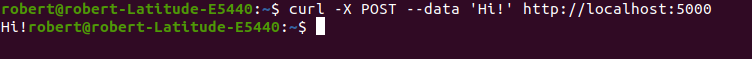

# DockerPython Simple Web Aplication
Manual
#Step 1: Create python simple MicroService Aplication.
* Simple microservice base on python flask
* Upload this app with Dockerfile to github

#Step 2:Create Account in Docker Hub 

* integrate my github repository to Docker Hub  
* Configure Automation Build solution 
* Explain this solution: Every time when I do push in git to new code To Master .Automatically i get last version of my container.
* Base on git Action

#Step 3:How I get last version of my container in Docker host.

* It's simple i just run this command "docker pull 456456/dockerpythont:master" and i get last success build from docker hub with latest code.
* After this we run our new docker container with this command "docker run -d -p 5000:5000 --name nauseous_wescoff -P 456456/dockerpythont"
* You can run my container in every docker host.

#Step 4: How you QA this

* first command docker pc -l
* second you go to your browser and launcher this app-> http://servername:5000
* curl -X POST --data 'Hi!' http://localhost:5000

#Step 5:UP Simple eks(k8s) cluster in Aws with terraform
* Example
* https://github.com/robert456456456456/Teraform_Poc it's my ripo poc
* https://www.fairwinds.com/blog/terraform-and-eks-a-step-by-step-guide-to-deploying-your-first-cluster
#Step 6: Create simple Helm-chart For run in K8S
* helm install mysite ./mysite --set service.type=NodePort
